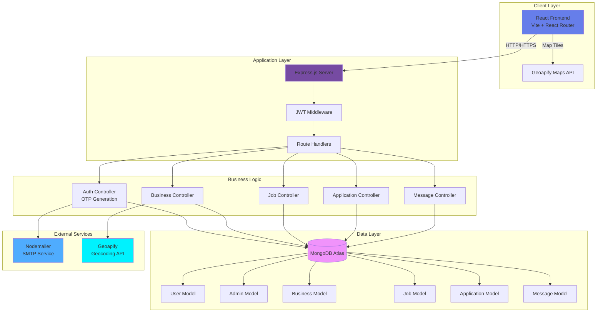
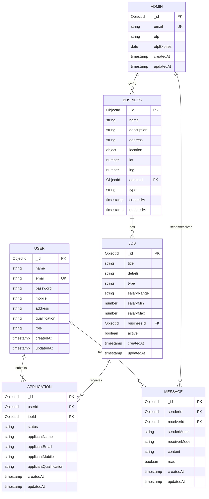
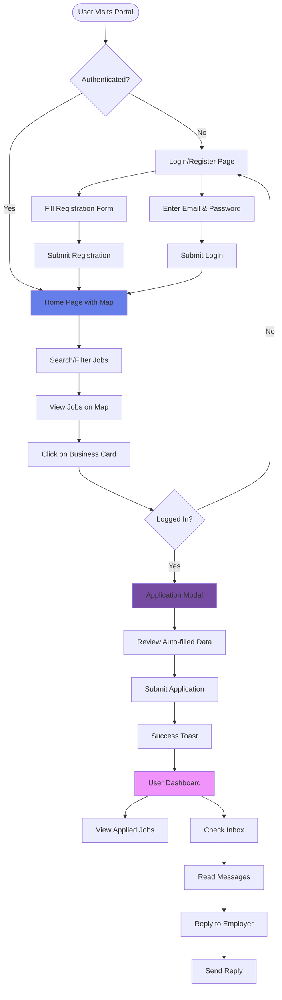
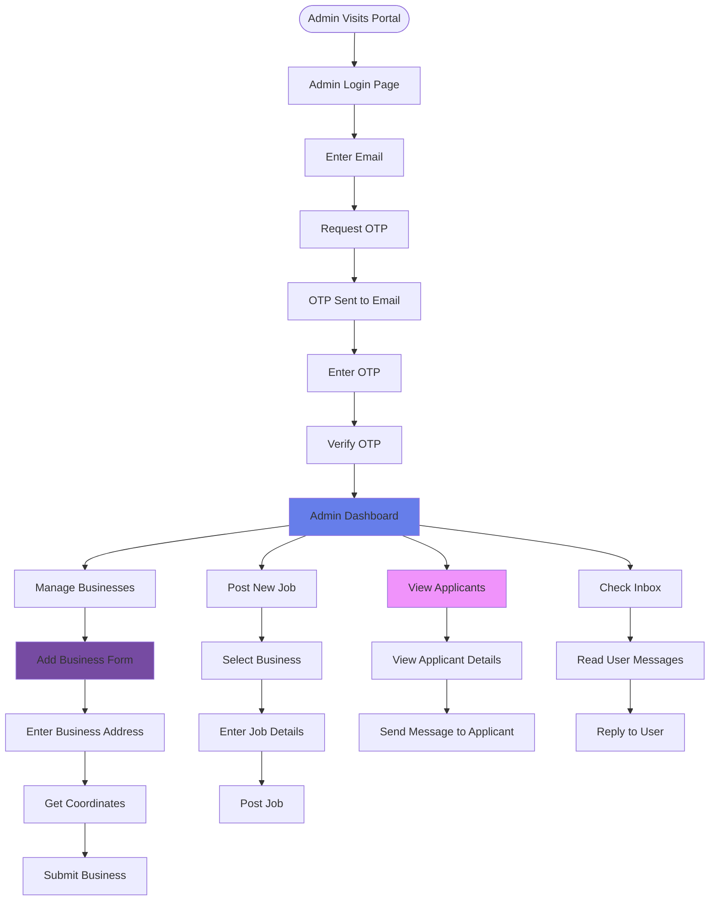
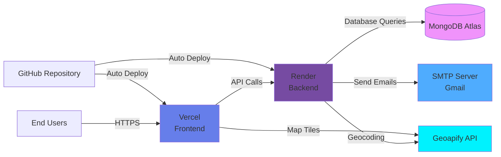

# 🚀 Job Portal - Location-Based Job Discovery Platform

A full-stack web application that connects job seekers with local businesses through an interactive map-based interface. Users can discover job opportunities near them, while businesses can post jobs and manage applications efficiently.

## 📋 Table of Contents
- [Problem Statement](#-problem-statement)
- [Requirements & Understanding](#-requirements--understanding)
- [Features](#-features)
- [Technology Stack](#-technology-stack)
- [System Architecture](#-system-architecture)
- [Database Schema](#-database-schema)
- [User Flow](#-user-flow)
- [Installation & Setup](#-installation--setup)
- [Deployment](#-deployment)
- [Testing](#-testing)
- [Future Enhancements](#-future-enhancements)

---

## 🎯 Problem Statement

Traditional job search platforms lack geographical context, making it difficult for:
- **Job Seekers**: To find nearby employment opportunities without extensive searching
- **Local Businesses**: To reach qualified candidates in their immediate vicinity
- **Both Parties**: To visualize job locations and make informed decisions based on proximity

### Solution
A location-aware job portal that:
1. Displays jobs on an interactive map with real-time filtering
2. Enables proximity-based job search
3. Facilitates direct communication between employers and applicants
4. Provides separate dashboards for users and business administrators

---

## 📝 Requirements & Understanding

### Functional Requirements

#### User Side
- ✅ User registration and authentication
- ✅ Browse jobs on interactive map (Geoapify Maps)
- ✅ Search and filter jobs by:
  - Business name/location
  - Job type (IT, Sales, Hotel Service, etc.)
  - Distance radius (5km, 10km, 50km)
  - Salary range
- ✅ Apply for jobs with auto-filled profile data
- ✅ View application history with timestamps
- ✅ Receive and reply to messages from employers
- ✅ Real-time unread message notifications

#### Admin/Business Side
- ✅ OTP-based admin authentication (email-based)
- ✅ Add and manage multiple businesses
- ✅ Post jobs linked to businesses
- ✅ View all applicants with detailed information
- ✅ Send messages to applicants
- ✅ Geocoding support for business addresses
- ✅ Real-time inbox with reply functionality

### Non-Functional Requirements
- **Security**: JWT-based authentication, bcrypt password hashing
- **Scalability**: MongoDB for flexible data storage
- **Responsiveness**: Mobile-friendly UI with modern design
- **Performance**: Optimized map rendering and filtering
- **User Experience**: Smooth animations, toast notifications, modal dialogs

---

## ✨ Features

### 🗺️ Interactive Map
- **Geoapify Maps Integration**: High-quality, customizable map interface
- **Business Markers**: Visual pins for each hiring business
- **Fullscreen Mode**: Immersive map viewing experience
- **Pan & Zoom**: Infinite zoom with directional navigation controls
- **Dynamic Filtering**: Map updates based on search criteria

### 👤 User Features
- **Smart Application**: Auto-populated forms from user profile
- **Application Tracking**: View all applications with date/time stamps
- **Messaging System**: Two-way communication with employers
- **Notification Badge**: Unread message counter
- **Profile Management**: Update personal and qualification details

### 🏢 Admin Features
- **Multi-Business Management**: Add unlimited businesses
- **Address Geocoding**: Automatic coordinate generation from addresses
- **Job Posting**: Create jobs with salary ranges and descriptions
- **Applicant Dashboard**: Comprehensive applicant information
- **Bulk Messaging**: Contact applicants directly
- **OTP Authentication**: Secure email-based login

### 🎨 UI/UX Features
- **Modern Design**: Gradient backgrounds, glassmorphism effects
- **Dark Mode Optimized**: Professional color schemes
- **Toast Notifications**: Success/error feedback
- **Modal Dialogs**: Clean application and messaging interfaces
- **Pagination**: Smart pagination with ellipses
- **Responsive Layout**: Works on all device sizes

---

## 🛠️ Technology Stack

### Frontend
```json
{
  "framework": "React 19.2.0",
  "build-tool": "Vite 7.2.4",
  "routing": "React Router DOM 7.11.0",
  "http-client": "Axios 1.13.2",
  "maps": "Geoapify Maps API",
  "icons": "React Icons 5.5.0",
  "styling": "Vanilla CSS"
}
```

### Backend
```json
{
  "runtime": "Node.js",
  "framework": "Express 5.2.1",
  "database": "MongoDB (Mongoose 9.1.2)",
  "authentication": "JWT (jsonwebtoken 9.0.3)",
  "password-hashing": "bcryptjs 3.0.3",
  "email": "Nodemailer 7.0.12",
  "security": "CORS 2.8.5"
}
```

### DevOps & Deployment
- **Frontend Hosting**: Vercel
- **Backend Hosting**: Render
- **Database**: MongoDB Atlas
- **Version Control**: Git/GitHub
- **Environment Management**: dotenv

---

## 🏗️ System Architecture



### Architecture Layers

1. **Client Layer**: React SPA with Vite bundler, handles UI rendering and user interactions
2. **Application Layer**: Express.js REST API with JWT-based authentication middleware
3. **Business Logic**: Controllers for authentication, business management, job posting, applications, and messaging
4. **Data Layer**: MongoDB with Mongoose ODM for schema validation and relationships
5. **External Services**: Email delivery (Nodemailer) and geocoding (Geoapify)

---

## 🗄️ Database Schema



### Schema Details

#### User Model
- Stores job seeker information
- Password hashed with bcrypt (10 salt rounds)
- Includes `matchPassword` method for authentication

#### Admin Model
- Email-based authentication with OTP
- OTP expires after set duration
- Can manage multiple businesses

#### Business Model
- Linked to admin via `adminId`
- Stores geolocation (lat/lng) for map display
- Supports multiple job types

#### Job Model
- Linked to business via `businessId`
- Flexible salary representation (range string + min/max numbers)
- Active/inactive status for job management

#### Application Model
- Links users to jobs
- Snapshots applicant data at application time
- Tracks application status (Applied, Viewed, etc.)

#### Message Model
- Polymorphic relationships (User ↔ Admin)
- Uses `refPath` for dynamic model references
- Read/unread status tracking

---

## 🔄 User Flow

### User Journey



### Admin Journey



---

## 📦 Installation & Setup

### Prerequisites
- Node.js (v16 or higher)
- MongoDB Atlas account (or local MongoDB)
- Geoapify API key
- Email service credentials (Gmail/SMTP)

### Backend Setup

1. **Navigate to Backend directory**
   ```bash
   cd Backend
   ```

2. **Install dependencies**
   ```bash
   npm install
   ```

3. **Create `.env` file**
   ```env
   PORT=5000
   MONGO_URI=your_mongodb_connection_string
   JWT_SECRET=your_jwt_secret_key
   
   # Email Configuration (Nodemailer)
   EMAIL_USER=your_email@gmail.com
   EMAIL_PASS=your_app_password
   
   # Frontend URL (for CORS)
   FRONTEND_URL=http://localhost:5173
   ```

4. **Start the server**
   ```bash
   # Development mode
   npm run dev
   
   # Production mode
   npm start
   ```

### Frontend Setup

1. **Navigate to Frontend directory**
   ```bash
   cd Frontend
   ```

2. **Install dependencies**
   ```bash
   npm install
   ```

3. **Create `.env` file**
   ```env
   VITE_API_URL=http://localhost:5000
   VITE_GEOAPIFY_MAPS_API_KEY=your_geoapify_api_key
   VITE_GOOGLE_MAPS_API_KEY=your_google_maps_api_key (optional)
   ```

4. **Start the development server**
   ```bash
   npm run dev
   ```

5. **Build for production**
   ```bash
   npm run build
   ```

---

## 🚀 Deployment

### Live Application

- **Frontend**: [https://job-portal-d7m2ae9mx-arvinds-projects-6e47830e.vercel.app](https://job-portal-d7m2ae9mx-arvinds-projects-6e47830e.vercel.app)
- **Backend**: [https://job-portal-ma7c.onrender.com](https://job-portal-ma7c.onrender.com)
- **Database**: MongoDB Atlas

### Deployment Architecture



### Backend Deployment (Render)

1. **Connect GitHub repository**
2. **Configure build settings**
   - Build Command: `npm install`
   - Start Command: `npm start`
3. **Set environment variables**
   - `MONGO_URI`
   - `JWT_SECRET`
   - `EMAIL_USER`
   - `EMAIL_PASS`
   - `FRONTEND_URL` (Vercel URL)
4. **Deploy**

### Frontend Deployment (Vercel)

1. **Import GitHub repository**
2. **Configure project**
   - Framework Preset: Vite
   - Build Command: `npm run build`
   - Output Directory: `dist`
3. **Set environment variables**
   - `VITE_API_URL` (Render backend URL)
   - `VITE_GEOAPIFY_MAPS_API_KEY`
4. **Deploy**

### Post-Deployment Checklist

- ✅ Update CORS settings in backend to allow Vercel domain
- ✅ Verify MongoDB Atlas IP whitelist includes Render IPs
- ✅ Test user registration and login
- ✅ Test admin OTP email delivery
- ✅ Verify map functionality
- ✅ Test job application flow
- ✅ Check messaging system
- ✅ Monitor error logs

---

## 🧪 Testing

### Manual Testing Checklist

#### User Flow Testing
- [ ] User registration with all fields
- [ ] User login with correct credentials
- [ ] User login with incorrect credentials
- [ ] Browse jobs on map
- [ ] Search jobs by business name
- [ ] Filter jobs by type
- [ ] Filter jobs by distance
- [ ] Apply for job (logged in)
- [ ] Apply for job (not logged in - redirect)
- [ ] View application history
- [ ] Check inbox for messages
- [ ] Reply to admin messages
- [ ] Unread message counter updates

#### Admin Flow Testing
- [ ] Admin OTP request
- [ ] Admin OTP verification
- [ ] Add new business
- [ ] Geocode business address
- [ ] Add business with manual coordinates
- [ ] Post new job
- [ ] View all applicants
- [ ] Send message to applicant
- [ ] Check inbox for user replies
- [ ] Reply to user messages

#### Map Testing
- [ ] Map loads correctly
- [ ] Business markers display
- [ ] Click on marker shows business details
- [ ] Fullscreen mode works
- [ ] Pan controls work (up, down, left, right)
- [ ] Zoom in/out works
- [ ] Map bounds filter businesses correctly

#### UI/UX Testing
- [ ] Responsive design on mobile
- [ ] Responsive design on tablet
- [ ] Toast notifications appear
- [ ] Modals open and close properly
- [ ] Pagination works correctly
- [ ] Forms validate input
- [ ] Loading states display

### API Endpoint Testing

#### Authentication Endpoints
```bash
# User Registration
POST /api/auth/register
Body: { name, email, password, mobile, address, qualification }

# User Login
POST /api/auth/login
Body: { email, password }

# Admin OTP Request
POST /api/auth/admin/login
Body: { email }

# Admin OTP Verification
POST /api/auth/admin/verify
Body: { email, otp }
```

#### Business Endpoints
```bash
# Get All Businesses
GET /api/businesses

# Get My Businesses (Admin)
GET /api/businesses/mine
Headers: { Authorization: Bearer <token> }

# Create Business (Admin)
POST /api/businesses
Headers: { Authorization: Bearer <token> }
Body: { name, description, address, lat, lng, type }
```

#### Job Endpoints
```bash
# Get All Jobs
GET /api/jobs

# Create Job (Admin)
POST /api/jobs
Headers: { Authorization: Bearer <token> }
Body: { title, details, type, salaryRange, businessId }
```

#### Application Endpoints
```bash
# Submit Application (User)
POST /api/applications
Headers: { Authorization: Bearer <token> }
Body: { jobId }

# Get My Applications (User)
GET /api/applications/mine
Headers: { Authorization: Bearer <token> }

# Get All Applicants (Admin)
GET /api/applications/admin/all
Headers: { Authorization: Bearer <token> }
```

#### Message Endpoints
```bash
# Get My Messages
GET /api/messages
Headers: { Authorization: Bearer <token> }

# Send Message
POST /api/messages
Headers: { Authorization: Bearer <token> }
Body: { receiverId, receiverModel, content }

# Mark Messages as Read
PUT /api/messages/mark-read
Headers: { Authorization: Bearer <token> }

# Get Unread Count
GET /api/messages/unread/count
Headers: { Authorization: Bearer <token> }
```

### Performance Testing
- **Page Load Time**: < 3 seconds
- **API Response Time**: < 500ms
- **Map Rendering**: < 2 seconds
- **Database Queries**: Indexed fields for optimization

---

## 🔮 Future Enhancements

### Phase 1: Enhanced Features
- [ ] **Resume Upload**: Allow users to upload PDF resumes
- [ ] **Job Bookmarking**: Save jobs for later application
- [ ] **Advanced Filters**: Experience level, education requirements
- [ ] **Salary Negotiation**: In-app salary discussion
- [ ] **Application Status Tracking**: Viewed, Shortlisted, Rejected, Hired
- [ ] **Email Notifications**: Application confirmations, status updates

### Phase 2: Analytics & Insights
- [ ] **Admin Analytics Dashboard**
  - Application conversion rates
  - Popular job types
  - Geographic distribution of applicants
- [ ] **User Recommendations**: AI-based job suggestions
- [ ] **Business Insights**: Competitor analysis, market trends

### Phase 3: Advanced Functionality
- [ ] **Video Interviews**: Integrated video calling
- [ ] **Skill Assessments**: Online tests for applicants
- [ ] **Multi-language Support**: i18n implementation
- [ ] **Mobile App**: React Native version
- [ ] **Real-time Chat**: WebSocket-based messaging
- [ ] **Calendar Integration**: Interview scheduling

### Phase 4: Monetization
- [ ] **Premium Listings**: Featured job posts
- [ ] **Subscription Plans**: For businesses
- [ ] **Advertisement System**: Banner ads for revenue
- [ ] **Recruiter Accounts**: Third-party recruitment agencies

### Technical Improvements
- [ ] **Unit Testing**: Jest + React Testing Library
- [ ] **Integration Testing**: Supertest for API
- [ ] **E2E Testing**: Playwright/Cypress
- [ ] **CI/CD Pipeline**: GitHub Actions
- [ ] **Monitoring**: Sentry for error tracking
- [ ] **Caching**: Redis for performance
- [ ] **CDN**: CloudFront for static assets
- [ ] **Search Optimization**: Elasticsearch integration

---

## 👥 Contributors

- **Developer**: Arvind Yadav
- **Project Type**: Full-Stack Web Application

---


## 🙏 Acknowledgments

- **Geoapify**: Map and geocoding services
- **MongoDB Atlas**: Database hosting
- **Vercel**: Frontend hosting
- **Render**: Backend hosting
- **React Community**: UI components and libraries

---

**Built with ❤️ using MERN Stack**
